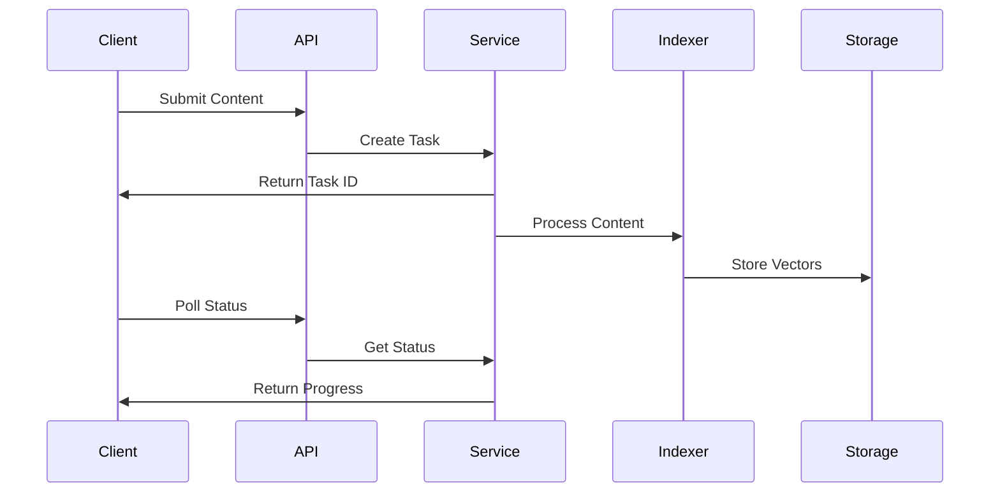

# AmBlue Architecture

## System Architecture

AmBlue is built as a modular, asynchronous application that implements Retrieval-Augmented Generation (RAG) for processing and indexing various content sources. The system follows clean architecture principles with clear separation of concerns.


### Component Hierarchy

```plaintext
AmBlue
├── API Layer (FastAPI)
│   ├── Routes
│   │   ├── Website Routes
│   │   ├── Wiki Routes
│   │   ├── Document Routes
│   │   └── Agent Routes
│   ├── Middleware
│   │   ├── Rate Limiting
│   │   ├── Error Handling
│   │   └── Authentication
│   └── Response Models
├── Service Layer
│   ├── Indexer Service
│   │   ├── Document Processing
│   │   ├── Embedding Generation
│   │   └── Vector Storage
│   ├── Website Service
│   │   ├── Sitemap Processing
│   │   ├── Content Extraction
│   │   └── Task Management
│   ├── Wiki Service
│   │   ├── Azure DevOps Integration
│   │   ├── Content Caching
│   │   └── Task Management
│   ├── Document Service
│   │   ├── File Processing
│   │   └── Content Extraction
│   └── Agent Service
│       ├── Question Processing
│       ├── Context Retrieval
│       └── Response Generation
└── Infrastructure Layer
    ├── ChromaDB
    │   ├── Collection Management
    │   ├── Vector Storage
    │   └── Similarity Search
    ├── Ollama Embeddings
    │   ├── Model Management
    │   └── Embedding Generation
    └── Storage
        ├── File System
        └── Caching
```

## Core Components

### 1. API Layer

Built with FastAPI, providing a high-performance asynchronous API:

- **Route Management**
  - RESTful endpoint design
  - Input validation using Pydantic models
  - Async request handling
  - Task status monitoring

- **Middleware**
  - Rate limiting (10 req/client)
  - Error handling and logging
  - Request/response validation
  - Performance monitoring

### 2. Service Layer

#### IndexerService
- Document processing pipeline management
- Text chunking with configurable parameters
- Embedding generation using Ollama
- Vector store integration with ChromaDB

#### WebsiteService
- Asynchronous website processing
- Sitemap parsing and validation
- Concurrent URL processing (max 10)
- Task progress tracking and status updates

#### WikiService
- Azure DevOps Wiki API integration
- TTL-based content caching (1 hour)
- Concurrent page processing
- Hierarchical content handling

#### DocumentService
- PDF and DOCX file processing
- Content extraction and cleaning
- Metadata extraction
- File type validation

#### AgentService
- RAG-based question processing
- Context retrieval optimization
- Response generation
- Answer quality monitoring

### 3. Infrastructure Layer

#### ChromaDB Integration
- Persistent vector storage
- Collection management
- Efficient similarity search
- Metadata management

#### Ollama Integration
- Embedding model management (nomic-embed-text)
- Batch processing optimization
- Error handling and retries

## Data Flow and Processing

### Content Processing Flow



### Task Management

1. **Task Creation**
   - Generate unique task ID
   - Initialize status tracking
   - Allocate resources

2. **Progress Monitoring**
   - Real-time status updates
   - Progress calculation
   - Error tracking

3. **Resource Management**
   - Connection pooling
   - Rate limiting
   - Cache management

## Error Handling Strategy

### Error Handling Layers

1. **API Layer**
   - Input validation errors
   - Rate limit violations
   - Authentication failures

2. **Service Layer**
   - Business logic errors
   - Resource availability
   - Task state management

3. **Processing Layer**
   - Content processing errors
   - Network timeouts
   - Resource exhaustion

### Recovery Mechanisms

- Automatic retries with backoff
- Graceful degradation
- Comprehensive error logging
- Task isolation

## Caching Strategy

### Cache Levels

1. **API Level**
   - Response caching
   - Rate limit tracking
   - Authentication tokens

2. **Content Level**
   - Wiki page caching (1h TTL)
   - Processed document caching
   - Embedding results

3. **Resource Level**
   - Database connections
   - API client pools
   - File handles

## Performance Optimization

### Key Optimizations

1. **Concurrency**
   - Async I/O operations
   - Connection pooling
   - Batch processing

2. **Resource Management**
   - Memory usage optimization
   - Connection pooling
   - File handle management

3. **Caching**
   - Strategic cache placement
   - TTL optimization
   - Cache size management

## Technical Stack

### Core Technologies

1. **FastAPI Framework**
   - High-performance async web framework
   - Native OpenAPI documentation
   - Type safety with Pydantic
   - Dependency injection
   - Middleware support
   - Server-sent events (SSE)

2. **Vector Store (ChromaDB)**
   - Persistent vector storage
   - Efficient similarity search
   - Rich metadata support
   - Collection management
   - Telemetry control
   - Configurable persistence

3. **Embedding Models**
   - Ollama for embeddings (nomic-embed-text)
   - 768-dimensional vectors
   - Batch processing support
   - Local deployment option

4. **Language Models**
   - Groq integration (deepseek-r1-distill-llama-70b)
   - Streaming response support
   - Context-aware processing
   - Think-tag handling

5. **Processing Pipeline**
   - LangChain integration
   - Document loaders (PDF, DOCX)
   - Text chunking (1000 chars, 200 overlap)
   - Async processing
   - Resource management

### Integration Features

1. **LangGraph Integration**
   - State management
   - Conversation flow control
   - Memory checkpointing
   - Async streaming

2. **Azure DevOps Integration**
   - Wiki content processing
   - API version 7.1
   - Authentication handling
   - Rate limiting

3. **Document Processing**
   - Multiple format support
   - Concurrent processing
   - Progress tracking
   - Resource cleanup

## Future Considerations

### Planned Enhancements

1. **Scalability**
   - Distributed processing
   - Load balancing
   - Cluster support

2. **Features**
   - Additional document types
   - Advanced search capabilities
   - Custom embedding models

3. **Monitoring**
   - Enhanced metrics
   - Performance tracking
   - Resource monitoring
