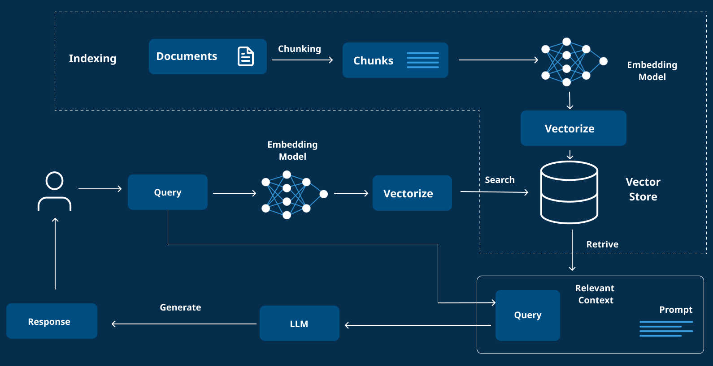

# AmBlue Architecture

## System Architecture
The AmBlue application follows a modular architecture with clear separation of concerns:



```plaintext
AmBlue
├── API Layer (FastAPI)
├── Service Layer
│   ├── Indexer Service
│   ├── Website Service
│   ├── Document Service
│   └── Vector Store Service
└── Infrastructure Layer
    ├── ChromaDB
    └── Ollama Embeddings
```

### Component Overview

1. **API Layer**

   - Handles HTTP requests
   - Input validation
   - Route management
   - Error handling

2. **Service Layer**

   - IndexerService: Manages document processing and embedding
   - WebsiteService: Handles website crawling and content extraction
   - WikiService: Manages Azure DevOps wiki content retrieval
   - AgentService: Handles RAG-based question answering
   - Vector Store: Manages document embeddings storage

3. **Infrastructure Layer**

   - ChromaDB for vector storage
   - Ollama for embedding generation
   - File system for persistent storage

## Data Flow

1. Client sends website URL
2. Website content is fetched and processed
3. Content is split into chunks
4. Chunks are embedded using Ollama
5. Embeddings are stored in ChromaDB

## Key Components Interaction

```plaintext
Client → FastAPI → AgentService → IndexerService → VectorStore → LLM
```

## Technical Decisions

- **FastAPI**: Chosen for high performance and async support
- **ChromaDB**: Selected for efficient vector storage and retrieval
- **Ollama**: Used for high-quality embeddings generation
